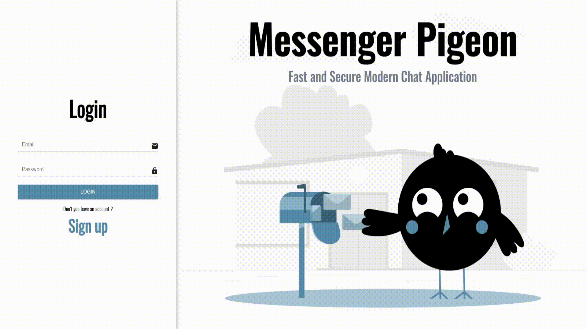

# Messenger Pigeon

Modern and fast chat application with firebase.

**Live demo: [https://messengerpigeon.netlify.app/](https://messengerpigeon.netlify.app/)**

## Built with

- [React](https://reactjs.org/)

- [Firebase](https://firebase.google.com/)

- [MUI](https://mui.com/)

- [React Router](https://v5.reactrouter.com/)

- [SweetAlert2](https://sweetalert2.github.io/)

- [Formik](https://formik.org/)

- [Yup](https://www.npmjs.com/package/yup)

## Getting Started

Clone the repository

```
git clone https://github.com/AhmedSemih/messenger-pigeon.git
```

After getting the starter files, you need to go the file directory and run

```
npm install
```

and after start the dev server

```
npm start
```

If you want to use your `Firebase Realtime Database` go to `src/Firebase/firebase-config` and change `Firebase config`.